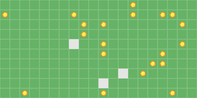

# Westworld

> *Photo by Alexander London on Unsplash*

## Description
**Westworld** is a multi-agent simulation library, its goal to simulate and optimize systems and environments with multiple agents interacting. Its inspiration is drawn from Unity software and [Unity ML Agents](https://github.com/Unity-Technologies/ml-agents), adapted in Python. 

The goal is to be able to simulate environments in logistics, retail, epidemiology, providing pre-coded spatial environments and communication between agents. Optimization can be included using heuristics as well as Reinforcement Learning.

!!! warning "Experimental"
    This library is extremely experimental, under active development and alpha-release
    Don't expect the documentation to be up-to-date or all features to be tested
    Please contact [us](mailto:theo.alves.da.costa@gmail.com) if you have any question

*The name is of course inspired by the TV series Westworld, which is actually a gigantic multi-agent simulation system.*


## Quickstart
Let's model an ecosystem of rabbits looking and competing for food



```python
from westworld.environment import GridEnvironment
from westworld.agents import BaseAgent
from westworld.objects import BaseCollectible
from westworld.simulation import Simulation
from westworld.colors import *

class Food(BaseCollectible):
    pass

class Rabbit(BaseAgent):
    
    def __init__(self,x,y,curiosity = 5):
        super().__init__(x,y,color = (229, 229, 229),curiosity = curiosity)
    
    def step(self):
        
        # Find closest food
        targets = self.find_closest(name = "Food",k = 1)
        
        # If there is still food, move towards the food
        if len(targets) > 0:
            
            target = targets[0]
            
            # Use naive pathfinding for faster computation as there is no obstacle
            self.move_towards(obj = target,naive = True)
            
        # Otherwise just wandering
        # Changing direction every n steps where n = curiosity
        else:
            self.wander()

food_spawner = lambda x,y : Food(x,y,color = (220,150,50),img_asset = "ball")
rabbit_spawner = lambda x,y : Rabbit(x,y,curiosity = 5)

# Setup environment
env = GridEnvironment(20,10,20,show_grid = True,background_color=(102, 178, 102),grid_color=(127, 191, 127),toroidal=True)
env.spawn(rabbit_spawner,3)
env.spawn(food_spawner,20)
env.render()

# Make simulation
sim = Simulation(env,fps = 10,name="Quickstart")
_,_ = sim.run_episode(n_steps = 50,save = True,replay = True,save_format="gif",)
```

## Features
### Current features
- Easy creation of Grid and non-grid environments
- Objects (Agents, Obstacles, Collectibles, Triggers)
- Subclassing of different objects to create custom objects
- Spawner to generate objects randomly in the environment
- Basic rigid body system for all objects
- Simple agent behaviors (pathfinding, wandering, random walk, fleeing, vision range)
- Automatic maze generation
- Layer integration to convert image to obstacle and snap it to a grid
- Sample simulations and sample agents for classic simulations
- Simulation visualization, replay and export (gif or video)

### Roadmap features
- More classic simulations and tutorials (boids, sugarscape)
- Better pathfinding
- Easy Reinforcement Learning integration with Stable Baselines
- Other visualization functions than PyGame for web integration 


## Installation
### Install from PyPi
The library is available on [PyPi](https://pypi.org/project/westworld/) via 
```
pip install westworld
```

### For developers
- You can clone the github repo / fork and develop locally
- Poetry is used for environment management, dependencies and publishing, after clone you can run 

```
# To setup the environment
poetry install

# To run Jupyter notebook or a python console
poetry run jupyter notebook
poetry run python
```

## Contributors
- [Théo Alves Da Costa](mailto:theo.alves.da.costa@gmail.com)


## Javascript version
A javascript version is being developed at https://github.com/TheoLvs/westworldjs

